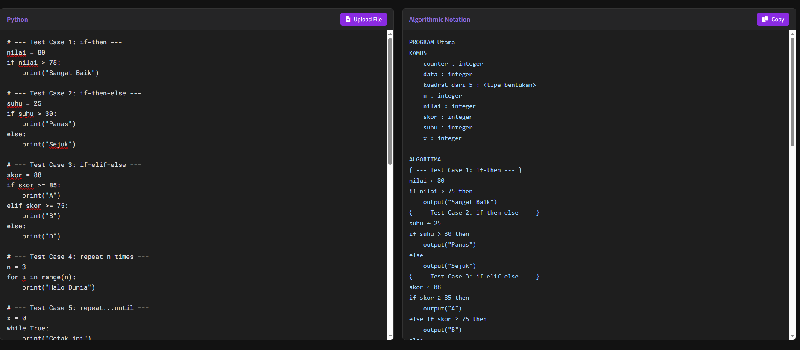

🚀✨ Flask Translator App
[![Python 3.x][Python-img]][Python-url] [![License: MIT][MIT-img]][MIT-url]

[Python-img]: https://img.shields.io/badge/Python-3.x-blue?style=for-the-badge
[Python-url]: https://www.python.org/
[MIT-img]: https://img.shields.io/badge/license-MIT-yellow?style=for-the-badge
[MIT-url]: https://mit-license.org/

> A minimalist Flask-based web app that converts Python code into itb-style algorithm pseudocode or we call it 'Notasi Algortima' , powered by regex and a customized parser engine.

---

✨ Quick Peek
- **Pure Python** → No external heavy NLP packages.
- **Smart Parser** → Converts comments, loops, conditionals, assignments, and more.
- **Interactive Web UI** → Input code, see real-time translated output.

---

🗂️ Project Layout
TSP-Flask-Translator/
├─ app.py             # Flask server and routing logic
├─ templates/
│  └─ index.html      # HTML template for input/output UI
├─ static/            # Optional CSS/JS assets
├─ README.md         # ← you are here

---

⚙️ Requirements
| Platform     | Required Tools       |
|--------------|----------------------|
| All OS       | Python 3.7+          |
| Recommended  | Flask (via pip)      |

Install dependencies:
```bash
pip install flask
```

---
Open this link https://python-to-itb-algorithm-notation-tr.vercel.app/ or
🔨 Run the App

1. Open terminal in project folder
2. Run:
```bash
python app.py
```
3. Access it via `http://127.0.0.1:5000/` in your browser.
---

▶️ How It Works

- Input Python code in the web interface
- Code is sent via POST to the Flask server
- Server calls `terjemahkan_python_ke_notasi_final(kode)` which:
  - Parses the structure line-by-line
  - Converts Python syntax to algorithm notation
  - Returns it to frontend as translated string

---

🧠 Under the Hood

### Translation Features:
- **Operators**: `== → =`, `!= → ≠`, `** → ^`, etc.
- **Control Flow**: `if`, `elif`, `else`, `while`, `for`, `return`, `break`
- **Function Definitions**: `def name(params):` → `function/procedure name(input ...)`
- **Type Inference**: Infers basic types (`integer`, `real`, `string`, etc.)
- **Loop Patterns**: Detects `repeat`, `iterate`, `until` patterns
- **Comment Mapping**: Python `#` to `{ ... }`
- **Realization Block**: Converts function blocks under `{ REALISASI FUNGSI/PROSEDUR }`

---

📸 Example Screenshot


---

📝 License
MIT — Because knowledge should be shared.  
See full license at: https://mit-license.org/

---

👤 Author
**Faqih Muhammad Syuhada (13523057)**  
Informatics — Institut Teknologi Bandung  
- GitHub: https://github.com/FaqihMSY  
- LinkedIn: https://www.linkedin.com/in/faqihmuhammadsyuhada/  
- Email: faqihmsy@gmail.com && 13523057@std.stei.itb.ac.id  

> Dibuat dengan regex, dnc, Flask, dan semangat ngoding tengah malam sambil makan mie goreng.
